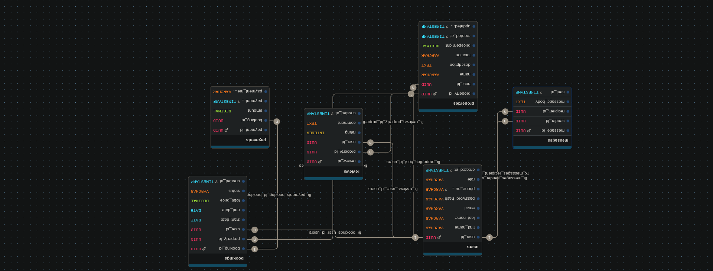

# Entity-Relationship Diagram (ERD) for Airbnb Database

## Overview

This document provides a detailed Entity-Relationship Diagram (ERD) for the Airbnb-style database system designed in this project. It outlines all entities, their attributes, primary and foreign keys, and the relationships between them. The ERD serves as the foundational blueprint for the schema normalization, database definition, and data seeding tasks.

---

## Entities and Attributes

### 1. **User**
- `user_id`: UUID, Primary Key
- `first_name`: VARCHAR, NOT NULL
- `last_name`: VARCHAR, NOT NULL
- `email`: VARCHAR, UNIQUE, NOT NULL
- `password_hash`: VARCHAR, NOT NULL
- `phone_number`: VARCHAR, NULL
- `role`: ENUM (`guest`, `host`, `admin`), NOT NULL
- `created_at`: TIMESTAMP, DEFAULT CURRENT_TIMESTAMP

### 2. **Property**
- `property_id`: UUID, Primary Key
- `host_id`: UUID, Foreign Key → `User(user_id)`
- `name`: VARCHAR, NOT NULL
- `description`: TEXT, NOT NULL
- `location`: VARCHAR, NOT NULL
- `pricepernight`: DECIMAL, NOT NULL
- `created_at`: TIMESTAMP, DEFAULT CURRENT_TIMESTAMP
- `updated_at`: TIMESTAMP, ON UPDATE CURRENT_TIMESTAMP

### 3. **Booking**
- `booking_id`: UUID, Primary Key
- `property_id`: UUID, Foreign Key → `Property(property_id)`
- `user_id`: UUID, Foreign Key → `User(user_id)`
- `start_date`: DATE, NOT NULL
- `end_date`: DATE, NOT NULL
- `total_price`: DECIMAL, NOT NULL
- `status`: ENUM (`pending`, `confirmed`, `canceled`), NOT NULL
- `created_at`: TIMESTAMP, DEFAULT CURRENT_TIMESTAMP

### 4. **Payment**
- `payment_id`: UUID, Primary Key
- `booking_id`: UUID, Foreign Key → `Booking(booking_id)`
- `amount`: DECIMAL, NOT NULL
- `payment_date`: TIMESTAMP, DEFAULT CURRENT_TIMESTAMP
- `payment_method`: ENUM (`credit_card`, `paypal`, `stripe`), NOT NULL

### 5. **Review**
- `review_id`: UUID, Primary Key
- `property_id`: UUID, Foreign Key → `Property(property_id)`
- `user_id`: UUID, Foreign Key → `User(user_id)`
- `rating`: INTEGER, CHECK (rating between 1 and 5), NOT NULL
- `comment`: TEXT, NOT NULL
- `created_at`: TIMESTAMP, DEFAULT CURRENT_TIMESTAMP

### 6. **Message**
- `message_id`: UUID, Primary Key
- `sender_id`: UUID, Foreign Key → `User(user_id)`
- `recipient_id`: UUID, Foreign Key → `User(user_id)`
- `message_body`: TEXT, NOT NULL
- `sent_at`: TIMESTAMP, DEFAULT CURRENT_TIMESTAMP

---

## Relationships (with Cardinality)

| Relationship                          | Cardinality     |
|--------------------------------------|-----------------|
| User → Property                      | 1 : N           |
| User → Booking                       | 1 : N           |
| User → Review                        | 1 : N           |
| User → Message (sent and received)   | 1 : N (both ways) |
| Property → Booking                   | 1 : N           |
| Property → Review                    | 1 : N           |
| Booking → Payment                    | 1 : 1           |

---

## ER Diagram

> 

The ER diagram above was created using [Drawdb.app](https://www.drawdb.app) and reflects the complete structure of the Airbnb database system. All entities, relationships, and keys are represented using crow's foot notation for clarity.

---

## Notes

- All primary keys are indexed automatically.
- `email` field in the `User` table has a unique index for authentication.
- Foreign keys are enforced across all relationships to maintain referential integrity.
- ENUM values and constraints are defined in SQL to simulate strict data validation.

---

